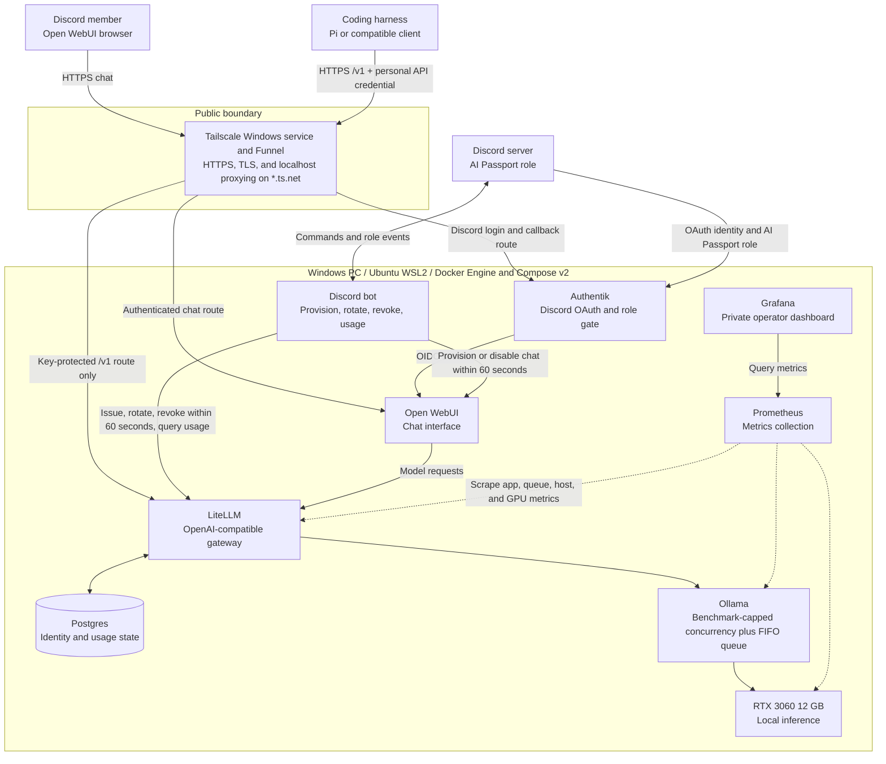

# Run AI Passport as a zero-cost single-host local service

> Superseded on 2026-08-10 by ADR 0002. This file preserves the former Windows/WSL architecture decision for history.

AI Passport will serve at most 5–10 trusted friends and family, use local inference only, incur no hosting or model-API charges, and be available only while the owner's GPU PC is powered on. The PC is the single physical host; no VPS is used. Before any public route is enabled, the host must be upgraded from Windows 10 to a supported, fully patched Windows 11 release. Host boot must restore the service without an interactive Windows login. The Tailscale Windows service starts before login, owns the node identity, provides Funnel HTTPS ingress, and proxies only configured public routes to WSL2 services through localhost. Docker Engine and Docker Compose v2 inside Ubuntu on WSL2 manage Authentik, Open WebUI, a Discord provisioning bot, LiteLLM with Postgres, Ollama on the RTX 3060 12 GB GPU, and a private Prometheus/Grafana monitoring stack.

Access is derived from a dedicated `AI Passport` Discord role. Adding the role permits Discord login and credential issuance; removing the role must disable chat access and revoke the member's API credential so new browser-chat and API requests fail within 60 seconds. A request already generating when the role is removed may finish, but no later request may start. The LiteLLM master interface, Ollama, Postgres, Grafana, and container administration ports remain private. Only authenticated chat and the key-protected LiteLLM API cross the public boundary.

Each member has one API credential with no automatic expiry. It remains valid until the member rotates it, the operator revokes it, or the member loses the `AI Passport` role. Rotation invalidates the previous credential immediately.

All public access uses one generated Tailscale hostname with the pattern `https://ryu-ai-passport.<tailnet-name>.ts.net`. The exact tailnet suffix is assigned during Tailscale setup. The root path serves Open WebUI, `/v1` serves the LiteLLM API, and Authentik/OIDC login and callback paths are routed on the same hostname.

The inference host will use bounded concurrency and queue excess requests in arrival order. Model selection, context length, KV-cache configuration, active concurrency, and queue limits remain benchmark-driven implementation choices and are not fixed by this ADR.

## Architecture

Public traffic terminates at Tailscale Funnel, which already performs TLS termination and local route forwarding; no standalone Nginx, Caddy, or other reverse-proxy container is required. Ollama, Postgres, Prometheus, Grafana, LiteLLM administrative routes, and container-management ports have no public route.

## Considered options

- A rented VPS public edge, matching the reference implementation more closely, was rejected because it creates recurring cost and remains online beyond the required availability window.
- A Mac-hosted public edge was rejected because both Mac and GPU PC would need to remain awake and two-machine operation adds failure modes.
- Vercel, a custom domain, and Cloudflare Tunnel were rejected for the MVP because Open WebUI removes the need for custom frontend hosting and Tailscale Funnel supplies a no-cost public HTTPS name.
- Windows 10 Consumer Extended Security Updates were rejected for public deployment because they provide only a temporary bridge and leave avoidable Docker support-policy ambiguity. Windows 10 may be used only for private setup and testing before the Windows 11 upgrade.
- Docker Desktop was rejected because its user-session lifecycle conflicts with restoring the service before interactive Windows login. Docker Engine runs inside Ubuntu WSL2; Windows Task Scheduler starts the distribution at boot, `systemd` starts Docker, and Compose restart policies restore containers.
- Running Tailscale inside WSL2 was rejected because ingress and node identity would share the distribution's lifecycle. Keeping Tailscale as a Windows service preserves identity across WSL rebuilds and lets ingress recover independently from Docker.
- Separate public hostnames or port-based addresses for chat, login, and API access were rejected because they complicate member instructions, OAuth callbacks, client configuration, and exposure controls without benefiting this small deployment.

## Consequences

- GPU PC is the single failure and availability boundary; when it sleeps or stops, all AI Passport functions stop.
- Tailscale Funnel is a beta dependency with fixed bandwidth limits and a `*.ts.net` hostname. Revisit ingress if those constraints harm chat streaming or agent use.
- No cloud fallback exists. Coding quality, context length, throughput, and concurrency are limited by the 12 GB GPU.
- The Windows 11 upgrade and current security patches are a deployment gate. Tailscale Funnel and external member access must remain disabled until the upgrade completes; private local setup and testing may proceed on Windows 10.
- Boot recovery must start the WSL2 environment and Docker daemon automatically, then restore containers through restart policies and health checks without requiring the operator to log in.
- Deployment validation must prove that the Windows Tailscale service can reach only intended WSL2 localhost ports after cold boot and that Windows and Hyper-V firewall rules do not expose private service ports.
- Route validation must prove that Open WebUI, LiteLLM, and every required Authentik/OIDC path work on the single hostname. A proven routing limitation requires a new ADR before adding a standalone reverse proxy.

## Continuation

Next-agent handoff: [`HANDOFF.md`](../../HANDOFF.md)
