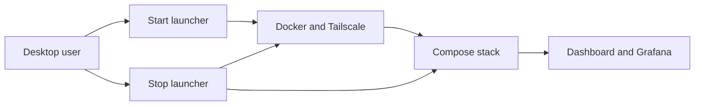

# Run AI Passport on a native Linux Mint personal desktop

## Context

ADR 0001 targeted Windows 11 with Ubuntu WSL2 and automatic cold-boot recovery. The owner instead chose to replace Windows with Linux Mint and keep this machine primarily a manually operated personal and gaming PC. AI Passport is an optional self-project, not an always-on home server.

## Decision

Run the zero-cost, single-host container architecture directly on Linux Mint 22.3 Cinnamon on host `ryupol`.

- Use native Linux Docker Engine and NVIDIA Container Toolkit; remove WSL boundaries and Windows exporter dependencies.
- Keep Docker, its socket, Tailscale, and all containers disabled/stopped at boot.
- Provide Start AI Passport and Stop AI Passport desktop launchers. They request the account password graphically for host service changes, then start or stop the Compose stack safely.
- Do not grant passwordless sudo or store credentials. Limit Docker-group membership to the trusted main account and document its root-equivalent access.
- Keep Secure Boot enabled unless a verified boot or NVIDIA module-signing failure requires a documented exception.
- Use automatic desktop login, no full-disk encryption, no Timeshift initially, and manual updates/reboots.
- Preserve private-by-default Tailscale exposure. Public Funnel remains explicit, narrow, and reversible.
- Show live Linux host, container, application, PostgreSQL, and NVIDIA GPU metrics in Grafana. Capacity forecasting is outside the MVP.

## Consequences

- Availability begins only after login and an explicit launcher action. This is intentional.
- Reboot leaves AI Passport offline, reducing gaming resource contention and background attack surface.
- Implementation uses Linux shell scripts and systemd, not PowerShell, Task Scheduler, WSL networking, or Windows services.
- The Stop launcher uses `docker compose down` without deleting named volumes, so project data remains.
- Automatic login and no disk encryption increase physical-access risk; this is accepted for a desktop that stays at home.
- Windows can be restored from verified media with its same-edition digital license, but applications and files are not restored.

## Migration

The operator follows `docs/linux-mint-migration-guide.md` before Slice 0. Until its readiness gates pass, all application slices remain planned and unverified.
